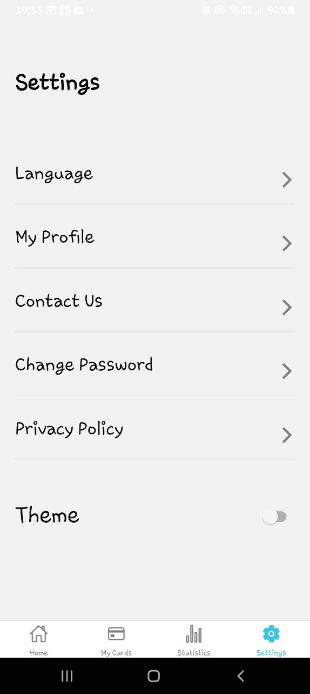

# RN Assignment 5

## Description

This React Native application demonstrates a simple app with Home and Settings screens, theme switching between light and dark modes, and custom components for a consistent UI design.

## Screenshots

